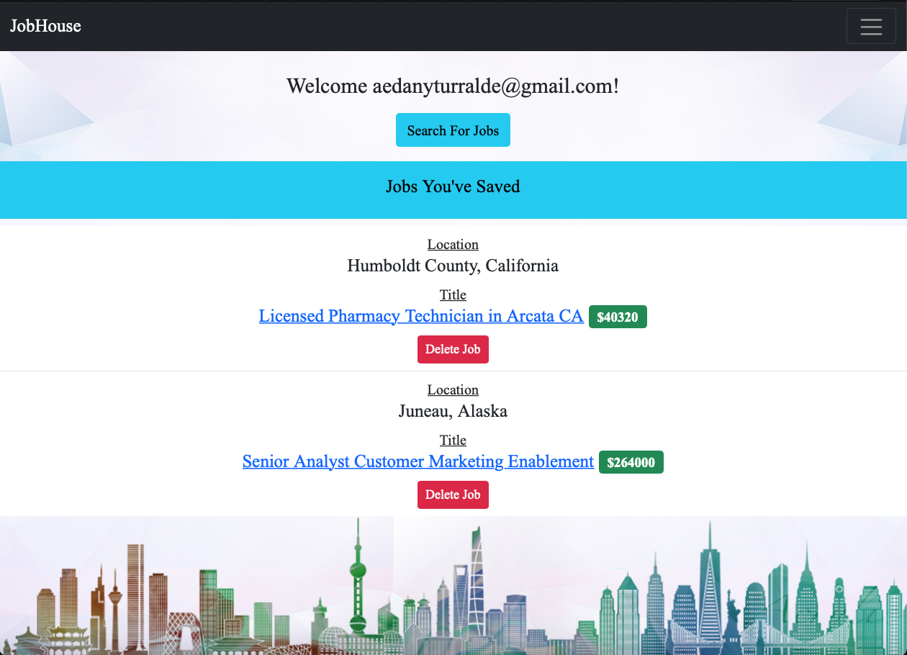
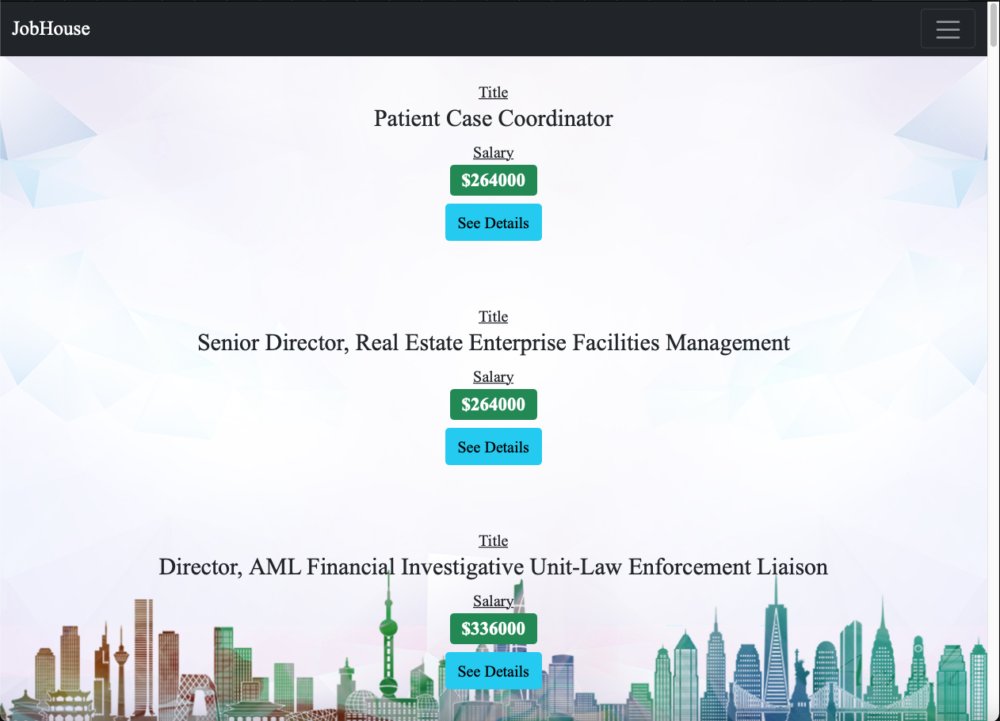
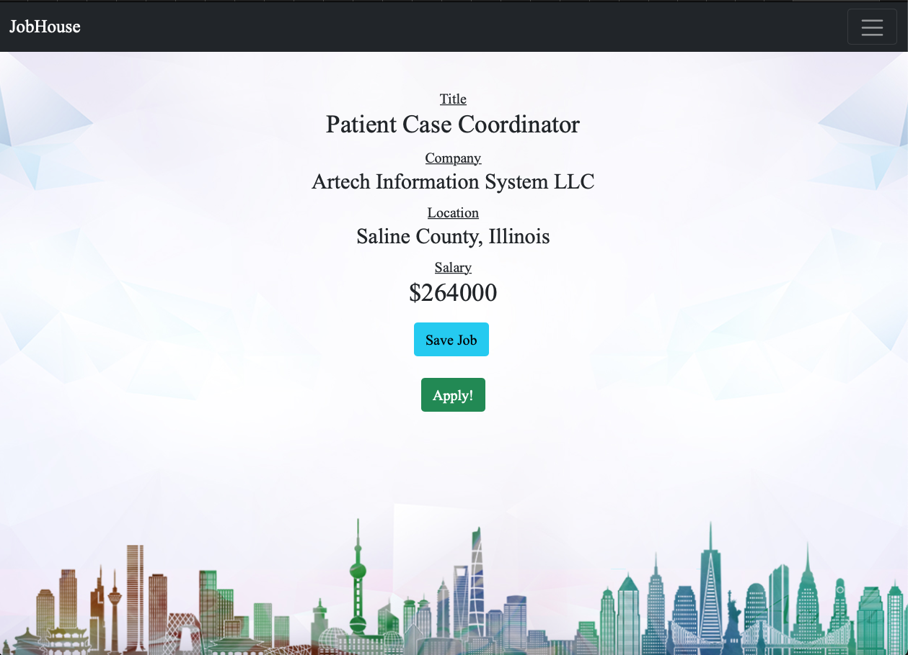

# [JOBHOUSE](https://glacial-waters-60806.herokuapp.com/)
+ This app was built in conjunction with the [JobHouse_be](https://github.com/aedanjames/job_house_be) API application
___
Job house is a Job search application, that also shows users housing in the same state is their potential job. Houses returned are filted useing a budget of 30% of the listed salary for a job and a 6% 30 year fixed mortgage.
___
* Ruby version
  * 2.7.2
* Rails
  * 5.2.7
___
Fork and clone this repo, youll find an entire test suite setup in the spec folder to run the Rspec-rails tests
to run the test files in your terminal run `bundle exec rspec`
___
### Walk Through
#### the landing page
+ When first visiting the landing page, the user is directed to sign in Using Googles Oauth2

#### User Dashboard

+ after signing in, the user is redirected to their personal dashboard
  + here a user can select to search for jobs

#### Searching for a job
  + Here a user can input a city to look for a new job and start their new life!

#### Jobs Index

+ here a user can see the returned jobs that match there location, they can see the title and salary

#### Unsaved job show
+ here a user can view the specific details of the job they are insterested in, they can also save the job for future reference if they are interetested, or be send to the jobs application page

#### Saved_job_show
+ after saving a job, the user is again given the opertunity to apply for the job, as well as being presented with a list of houses that they can "afford".
Currently the application assumes the following:
    + 30% monthly income set aside for mortgage payments
    + 6% interest rate on the mortgage
    + 30 year fixed term on the mortgage

## CONTRIBUTORS
* [Aedan](https://github.com/aedanjames)
* [Eldridge](https://github.com/Eldridge-Turambi)
* [Austin](https://github.com/AustinCMoore)
* [Sam](https://github.com/samlsmith424)
* [Richard](https://github.com/RichardLaBrecque)
